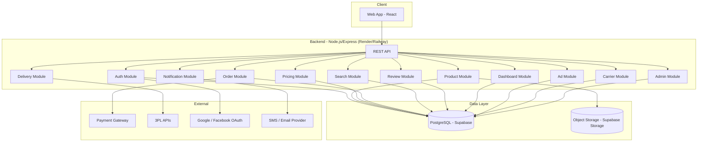
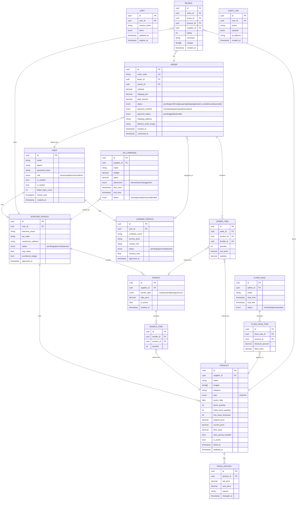

# Tài Liệu Thiết Kế Kỹ Thuật – ShortDate

## Tổng Quan

ShortDate là sàn thương mại điện tử chuyên biệt kết nối nhà cung cấp (Supplier) với người tiêu dùng (Buyer) trong lĩnh vực thực phẩm sắp hết hạn sử dụng. Mục tiêu kép của nền tảng là: (1) giúp Supplier thanh lý hàng tồn trước HSD với doanh thu tối ưu, và (2) giúp Buyer mua thực phẩm chất lượng với giá thấp hơn 30–80% so với giá gốc.

Hệ thống phục vụ hai nhóm sản phẩm với đặc thù vận hành khác nhau:
- **Dry_Product** (HSD 30–90 ngày): giao hàng toàn quốc qua 3PL, quản lý tồn kho theo lô.
- **Fresh_Product** (HSD 0–1 ngày): giao hàng nhanh nội thành trong 4 giờ, tồn kho cực ngắn.

Điểm khác biệt cốt lõi của ShortDate là **Auto_Pricing_Engine** – tự động điều chỉnh giá theo thời gian còn lại đến HSD và tỷ lệ tồn kho bằng công thức toán học đơn giản, giúp tối đa hóa tỷ lệ bán hết trước HSD.

> **Ghi chú:** Đây là phiên bản demo sinh viên triển khai trên nền tảng miễn phí. Kiến trúc được đơn giản hóa tối đa để phù hợp với giới hạn tài nguyên. Các tính năng nâng cao (AI/ML pricing, Kafka, Elasticsearch, Redis, microservices) được ghi chú là hướng mở rộng trong tương lai.

---

## Kiến Trúc Hệ Thống

### Kiến Trúc Tổng Thể

ShortDate áp dụng kiến trúc **monolith** (React + Node.js/Express), triển khai trên các nền tảng free tier:

- **Frontend**: React → deploy trên **Vercel** (free)
- **Backend**: Node.js + Express (REST API) → deploy trên **Render** hoặc **Railway** (free)
- **Database**: PostgreSQL → **Supabase** free tier




### Các Quyết Định Kiến Trúc Quan Trọng

| Quyết định | Lựa chọn | Lý do |
|---|---|---|
| Kiến trúc tổng thể | Monolith (Express) | Đơn giản, dễ deploy, phù hợp free tier |
| Database chính | PostgreSQL (Supabase) | ACID transactions, free tier đủ dùng cho demo |
| Price history | Bảng PostgreSQL thông thường | Đủ cho demo, không cần TimescaleDB |
| Search | PostgreSQL full-text search (`tsvector`) | Không cần Elasticsearch cho quy mô demo |
| Session / Cart | JWT + bảng `carts` trong PostgreSQL | Không cần Redis |
| Auto-pricing | Công thức toán học (daysLeft, stockRatio) | Không cần AI/ML cho demo |
| File storage | Supabase Storage | Free tier, tích hợp sẵn với Supabase |
| Messaging | Xử lý đồng bộ trong request | Không cần Kafka cho quy mô demo |

---

## Các Thành Phần và Giao Diện

### 1. Auth Module

Quản lý xác thực và phân quyền cho tất cả người dùng (Buyer, Supplier, Admin).

**Trách nhiệm:**
- Đăng ký tài khoản (email/phone + password, OAuth)
- Đăng nhập, cấp phát JWT access token + refresh token
- Xác minh email/SMS OTP
- Khóa tài khoản sau 5 lần nhập sai mật khẩu
- Phát hiện đăng nhập bất thường, yêu cầu OTP bổ sung
- Xét duyệt tài khoản Supplier (Admin workflow)

**API chính:**

```
POST /auth/register
POST /auth/login
POST /auth/oauth/:provider
POST /auth/verify
POST /auth/refresh
POST /auth/logout
POST /auth/supplier/apply
PUT  /auth/supplier/:id/approve
POST /auth/carrier/apply
PUT  /auth/carrier/:id/approve
```

### 2. Product Module

Quản lý vòng đời sản phẩm từ niêm yết đến ẩn/xóa.

**Trách nhiệm:**
- CRUD sản phẩm (Product, Bundle)
- Validate thông tin bắt buộc khi niêm yết
- Cảnh báo HSD và tồn kho thấp
- Phân loại Dry_Product / Fresh_Product
- Quản lý Bundle (tạo, ẩn khi hết hàng)

**API chính:**

```
POST   /products
GET    /products/:id
PUT    /products/:id
DELETE /products/:id
PATCH  /products/:id/inventory
POST   /bundles
GET    /bundles/:id
PUT    /bundles/:id
```

### 3. Pricing Module

Điều phối Auto_Pricing_Engine bằng công thức toán học.

**Trách nhiệm:**
- Chạy Auto_Pricing_Engine theo chu kỳ ≤ 1 giờ (cron job)
- Áp dụng quy tắc giảm giá theo HSD và tồn kho
- Đảm bảo giá không thấp hơn giá sàn Supplier
- Ghi lịch sử thay đổi giá vào bảng `price_history` (PostgreSQL)
- Quản lý Flash Sale (bật/tắt giá theo lịch)

**API chính:**

```
GET  /pricing/:productId/current
GET  /pricing/:productId/history
PUT  /pricing/:productId/config
POST /flash-sales
PUT  /flash-sales/:id/activate
```

### 4. Auto_Pricing_Engine – Công Thức Toán Học

Thay vì AI/ML, engine sử dụng công thức đơn giản dựa trên hai biến:
- `daysLeft`: số ngày còn lại đến HSD
- `stockRatio`: tỷ lệ tồn kho hiện tại / tồn kho ban đầu (0–1)

**Tính Product_Risk_Score (0–100):**

```
Dry_Product:
  timeScore  = max(0, 1 - daysLeft / 90) * 60
  stockScore = stockRatio * 40
  riskScore  = timeScore + stockScore

Fresh_Product:
  timeScore  = max(0, 1 - daysLeft / 1) * 70
  stockScore = stockRatio * 30
  riskScore  = timeScore + stockScore
```

**Tính discount từ riskScore:**

```
if riskScore >= 70  → discount = min(80%, 40% + (riskScore - 70) * 1%)
if riskScore >= 30  → discount = 10% + (riskScore - 30) * 0.75%
if riskScore < 30   → discount = 10%

Áp dụng thêm:
  if daysLeft < 1   → discount = max(discount, 50%)
  if stockRatio > 0.8 và đã qua 50% thời gian → discount += 10%

Giá cuối = max(floor_price, originalPrice * (1 - discount))
```

> **Ghi chú:** AI_Pricing_Module (Computer Vision + ML) là tính năng mở rộng trong tương lai. Supplier tự nhập thông tin sản phẩm; hệ thống không cần phân tích hình ảnh tự động ở phiên bản demo này.

### 5. Search Module

Tìm kiếm và lọc sản phẩm sử dụng PostgreSQL full-text search.

**Trách nhiệm:**
- Full-text search theo tên sản phẩm (`tsvector` + `tsquery`)
- Lọc theo HSD, danh mục, khu vực, giảm giá, giá, loại sản phẩm
- Sắp xếp theo nhiều tiêu chí
- Gợi ý sản phẩm dựa trên lịch sử Buyer

**API chính:**

```
GET /search/products?q=&filters=&sort=&page=
GET /search/suggestions/:buyerId
```

**Ví dụ query PostgreSQL:**

```sql
SELECT * FROM products
WHERE to_tsvector('simple', name) @@ plainto_tsquery('simple', :query)
  AND days_until_expiry BETWEEN :minDays AND :maxDays
  AND category = :category
  AND discount_percent >= :minDiscount
ORDER BY expiry_date ASC
LIMIT 20 OFFSET :offset;
```

### 6. Order Module

Quản lý giỏ hàng và vòng đời đơn hàng.

**Trách nhiệm:**
- Quản lý giỏ hàng (lưu trong bảng `carts` + JWT cho ẩn danh)
- Tạo Order, sinh mã đơn hàng duy nhất
- Trừ tồn kho ngay khi xác nhận đặt hàng
- Tích hợp Payment Gateway
- Gửi xác nhận đơn hàng trong ≤ 60 giây

**API chính:**

```
POST   /cart/items
DELETE /cart/items/:id
GET    /cart
POST   /orders
GET    /orders/:id
POST   /orders/:id/cancel
POST   /payments/initiate
POST   /payments/callback
```

### 7. Delivery Module

Điều phối giao hàng cho cả Fresh_Product và Dry_Product. Khi Supplier bàn giao đơn hàng, hệ thống phân công Carrier phù hợp (với Fresh_Product) hoặc nhận webhook cập nhật trạng thái từ 3PL (với Dry_Product).

**API chính:**

```
GET  /delivery/zones/check?address=
POST /delivery/orders/:orderId
GET  /delivery/orders/:orderId/track
POST /delivery/orders/:orderId/assign-carrier
POST /delivery/webhook/3pl
```

### 8. Carrier Module

Cung cấp công cụ cho Carrier nhận đơn, cập nhật trạng thái giao hàng và xem tổng quan hiệu suất.

**Trách nhiệm:**
- Hiển thị danh sách đơn hàng được phân công cho Carrier
- Cho phép Carrier cập nhật trạng thái giao hàng kèm hình ảnh xác nhận
- Cung cấp trang tổng quan hiệu suất Carrier

**API chính:**

```
GET   /carrier/orders
PATCH /carrier/orders/:orderId/status
GET   /carrier/dashboard
```

### 8. Notification Module

Gửi thông báo đa kênh (email, SMS) xử lý đồng bộ trong request hoặc qua cron job.

### 9. Dashboard Module

Cung cấp dữ liệu phân tích cho Supplier_Dashboard bằng các query tổng hợp trực tiếp trên PostgreSQL.

### 10. Ad Module & Review Module

Quản lý quảng cáo nội sàn và đánh giá sản phẩm/Supplier.

### 11. Admin Module

Cung cấp công cụ quản trị toàn diện cho Admin: quản lý người dùng, kiểm duyệt sản phẩm, giám sát hệ thống.

**Trách nhiệm:**
- Quản lý tài khoản Buyer, Supplier, Carrier (xem, khóa/mở khóa)
- Kiểm duyệt và khóa sản phẩm vi phạm chính sách
- Xem audit log hệ thống
- Xem tổng quan hoạt động toàn sàn

**API chính:**

```
GET /admin/users
PUT /admin/users/:id/lock
GET /admin/products
PUT /admin/products/:id/lock
GET /admin/audit-logs
GET /admin/dashboard
```

---

## Mô Hình Dữ Liệu

### Bảng Chính (PostgreSQL)




### Ghi Chú Về Lưu Trữ

- **Price history**: Lưu trong bảng `price_history` PostgreSQL thông thường (thay vì TimescaleDB). Đủ hiệu năng cho quy mô demo.
- **Search**: Sử dụng PostgreSQL `tsvector`/`tsquery` với index GIN (thay vì Elasticsearch). Đủ cho full-text search tiếng Việt ở quy mô demo.
- **Session / Cart**: Lưu trong bảng `carts` PostgreSQL + JWT (thay vì Redis). Cart ẩn danh dùng `session_token` trong cookie.
- **Images**: Lưu trên Supabase Storage (thay vì S3 riêng).

---

## Thuộc Tính Đúng Đắn (Correctness Properties)

*A property is a characteristic or behavior that should hold true across all valid executions of a system — essentially, a formal statement about what the system should do. Properties serve as the bridge between human-readable specifications and machine-verifiable correctness guarantees.*


### Property 1: Đăng ký tài khoản với dữ liệu hợp lệ luôn thành công

*For any* email hoặc số điện thoại hợp lệ chưa tồn tại trong hệ thống và mật khẩu đáp ứng yêu cầu, thao tác đăng ký phải tạo ra một tài khoản mới và trả về kết quả thành công.

**Validates: Requirements 1.1**

### Property 2: Không cho phép đăng ký trùng email/phone

*For any* email hoặc số điện thoại đã tồn tại trong hệ thống, thao tác đăng ký phải bị từ chối và trả về thông báo lỗi "Tài khoản đã tồn tại" — tài khoản mới không được tạo ra.

**Validates: Requirements 1.2**

### Property 3: Tài khoản chưa xác minh bị giới hạn quyền truy cập

*For any* tài khoản chưa xác minh, mọi thao tác ngoài xem sản phẩm (đặt hàng, thanh toán, niêm yết,...) đều phải bị từ chối với mã lỗi phân quyền phù hợp.

**Validates: Requirements 1.4**

### Property 4: Khóa tài khoản sau 5 lần nhập sai mật khẩu

*For any* tài khoản hợp lệ, sau đúng 5 lần đăng nhập thất bại liên tiếp, tài khoản phải bị khóa và mọi lần đăng nhập tiếp theo trong vòng 15 phút phải bị từ chối.

**Validates: Requirements 1.6**

### Property 5: Validation đầy đủ khi niêm yết sản phẩm

*For any* tập hợp con của các trường bắt buộc bị thiếu khi niêm yết Product, hệ thống phải từ chối lưu và response phải chứa đúng danh sách các trường còn thiếu đó — không có trường nào bị bỏ sót trong thông báo lỗi.

**Validates: Requirements 2.1, 2.2**

### Property 6: Cảnh báo HSD sắp hết cho Supplier

*For any* Product có HSD còn dưới 7 ngày, hệ thống phải tạo ra notification event cảnh báo gửi đến Supplier tương ứng.

**Validates: Requirements 2.4**

### Property 7: Cảnh báo khi Dry_Product có HSD ngoài khoảng hợp lệ

*For any* Dry_Product được niêm yết với HSD dưới 30 ngày hoặc trên 90 ngày, hệ thống phải trả về cảnh báo xác nhận trước khi cho phép lưu.

**Validates: Requirements 2.7**

### Property 8: Auto_Pricing_Engine áp dụng giảm giá tối thiểu 50% khi HSD < 24 giờ

*For any* Product có thời gian còn lại đến HSD dưới 24 giờ và Auto_Pricing_Engine đang bật, giá bán sau khi engine chạy phải không cao hơn 50% giá gốc (tức là chiết khấu ≥ 50%).

**Validates: Requirements 4.2**

### Property 9: Auto_Pricing_Engine tăng chiết khấu khi tồn kho cao và thời gian cạn

*For any* Product có tỷ lệ tồn kho > 80% sau khi đã qua 50% thời gian từ nhập kho đến HSD, Auto_Pricing_Engine phải tăng mức chiết khấu hiện tại thêm tối thiểu 10%.

**Validates: Requirements 4.3**

### Property 10: Giá sau điều chỉnh không bao giờ thấp hơn giá sàn

*For any* Product có cấu hình giá sàn tối thiểu (floor_price), sau bất kỳ lần chạy Auto_Pricing_Engine nào, giá bán kết quả phải luôn >= floor_price.

**Validates: Requirements 4.4**

### Property 11: Lịch sử giá được ghi lại đầy đủ sau mỗi thay đổi

*For any* thay đổi giá do Auto_Pricing_Engine thực hiện, hệ thống phải ghi một bản ghi vào bảng `price_history` chứa đủ: thời điểm thay đổi, giá cũ, giá mới và lý do thay đổi.

**Validates: Requirements 4.5**

### Property 12: Product_Risk_Score luôn nằm trong khoảng [0, 100]

*For any* Product được tính điểm bởi hàm `calculateRiskScore`, giá trị Product_Risk_Score trả về phải luôn nằm trong khoảng từ 0 đến 100 (bao gồm hai đầu mút).

**Validates: Requirements 5.2**

### Property 13: Mapping Risk Score → mức chiết khấu đề xuất đúng ngưỡng

*For any* Product, nếu Risk Score >= 70 thì chiết khấu đề xuất phải >= 40%; nếu Risk Score < 30 thì chiết khấu đề xuất phải nằm trong khoảng [10%, 20%].

**Validates: Requirements 5.3, 5.4**

### Property 14: Giá trị thực trong Bundle luôn cao hơn giá bán tối thiểu 30%

*For any* Bundle được lưu thành công trong hệ thống, tổng giá trị thực của các Product trong Bundle phải luôn >= giá bán Bundle × 1.3.

**Validates: Requirements 3.2, 3.4**

### Property 15: Bundle tự động ẩn khi có Product hết hàng

*For any* Bundle đang hiển thị, khi bất kỳ Product nào trong Bundle có stock_quantity về 0, Bundle đó phải chuyển sang trạng thái ẩn và không xuất hiện trong kết quả tìm kiếm.

**Validates: Requirements 3.6**

### Property 16: Kết quả tìm kiếm thỏa mãn tất cả bộ lọc đã áp dụng

*For any* tập hợp bộ lọc (HSD, danh mục, khu vực, giảm giá, giá, loại sản phẩm), mọi Product trong kết quả trả về phải thỏa mãn đồng thời tất cả các điều kiện lọc đã chỉ định.

**Validates: Requirements 6.2**

### Property 17: Kết quả tìm kiếm được sắp xếp đúng theo tiêu chí

*For any* tùy chọn sắp xếp (HSD gần nhất, giảm giá cao nhất, giá thấp nhất, mới nhất), danh sách kết quả trả về phải có thứ tự không giảm (hoặc không tăng) theo trường tương ứng.

**Validates: Requirements 6.4**

### Property 18: Flash Sale áp dụng đúng giá khi kích hoạt

*For any* Flash Sale được kích hoạt, giá hiện tại của mỗi Product tham gia phải bằng giá Flash Sale đã cấu hình (không phải giá gốc hay giá Auto_Pricing_Engine).

**Validates: Requirements 7.2**

### Property 19: Giá được khôi phục sau khi Flash Sale kết thúc

*For any* Product tham gia Flash Sale, sau khi Flash Sale kết thúc, giá hiện tại phải trở về giá trước khi Flash Sale bắt đầu (hoặc giá Auto_Pricing_Engine nếu engine đang bật).

**Validates: Requirements 7.3**

### Property 20: Số lượng trong giỏ hàng không vượt quá tồn kho

*For any* thao tác thêm vào giỏ hàng với số lượng bất kỳ, số lượng thực tế được lưu trong giỏ hàng phải luôn <= stock_quantity hiện tại của Product đó.

**Validates: Requirements 8.2**

### Property 21: Mã đơn hàng là duy nhất trong toàn hệ thống

*For any* tập hợp đơn hàng được tạo ra, không có hai đơn hàng nào có cùng order_code.

**Validates: Requirements 8.5**

### Property 22: Tồn kho giảm đúng số lượng sau khi đặt hàng

*For any* đơn hàng được xác nhận thành công, tổng stock_quantity của mỗi Product trong đơn phải giảm đúng bằng số lượng đã đặt so với trước khi đặt hàng.

**Validates: Requirements 8.6**

### Property 23: Đơn hàng chứa Fresh_Product chỉ cho phép giao hàng nhanh nội thành

*For any* đơn hàng chứa ít nhất một Fresh_Product, danh sách tùy chọn giao hàng trả về phải chỉ bao gồm giao hàng nhanh nội thành — không có tùy chọn 3PL toàn quốc.

**Validates: Requirements 9.3**

### Property 24: Review chỉ được tạo trong 7 ngày sau khi giao hàng thành công

*For any* đơn hàng, review chỉ được chấp nhận khi trạng thái đơn hàng là "delivered" và thời điểm tạo review nằm trong vòng 7 ngày kể từ ngày giao hàng thành công.

**Validates: Requirements 13.1**

### Property 25: Validation nội dung đánh giá

*For any* review được gửi lên, hệ thống phải từ chối nếu rating nằm ngoài khoảng [1, 5] hoặc độ dài comment nhỏ hơn 10 ký tự.

**Validates: Requirements 13.2**

### Property 26: Audit log được ghi cho mọi thao tác quan trọng

*For any* thao tác quan trọng (đăng nhập, thay đổi giá, tạo/hủy đơn hàng, thay đổi thông tin tài khoản), hệ thống phải ghi một bản ghi vào bảng `audit_log` chứa đủ thông tin về thao tác đó.

**Validates: Requirements 15.5**

### Property 27: Carrier chỉ cập nhật được đơn hàng được phân công cho mình

*For any* Carrier đã xác thực, thao tác cập nhật trạng thái giao hàng phải bị từ chối nếu `carrier_id` của đơn hàng không khớp với ID của Carrier đang thực hiện yêu cầu — không có ngoại lệ.

**Validates: Requirements 10.3, 10.4**

### Property 28: Ảnh xác nhận bắt buộc khi Carrier cập nhật trạng thái "đã giao"

*For any* yêu cầu cập nhật trạng thái đơn hàng thành "đã giao" mà không kèm hình ảnh xác nhận, hệ thống phải từ chối yêu cầu đó và trả về lỗi validation.

**Validates: Requirements 10.5**

### Property 29: Admin lock product → product không xuất hiện trong search results

*For any* Product bị Admin khóa (trạng thái locked), Product đó phải không xuất hiện trong bất kỳ kết quả tìm kiếm hay danh sách hiển thị nào trên sàn — bất kể bộ lọc hay từ khóa tìm kiếm là gì.

**Validates: Requirements 14.12**

---

## Xử Lý Lỗi

### Nguyên Tắc Chung

- Tất cả API trả về lỗi theo chuẩn RFC 7807 (Problem Details for HTTP APIs)
- Mã lỗi HTTP chuẩn: 400 (validation), 401 (unauthenticated), 403 (unauthorized), 404 (not found), 409 (conflict), 422 (business rule violation), 429 (rate limit), 500 (internal)
- Không bao giờ expose stack trace hoặc thông tin nội bộ trong response lỗi production

```json
{
  "type": "https://shortdate.vn/errors/validation-failed",
  "title": "Validation Failed",
  "status": 422,
  "detail": "Thiếu thông tin bắt buộc khi niêm yết sản phẩm",
  "missing_fields": ["expiry_date", "stock_quantity"]
}
```

### Xử Lý Lỗi Theo Domain

| Domain | Tình huống lỗi | Xử lý |
|---|---|---|
| Auth | Đăng ký trùng email/phone | 409 Conflict + thông báo rõ ràng |
| Auth | Sai mật khẩu lần 5 | 423 Locked + thời gian mở khóa |
| Auth | Token hết hạn | 401 + hướng dẫn refresh |
| Product | Thiếu trường bắt buộc | 422 + danh sách trường thiếu |
| Product | HSD không hợp lệ cho Dry_Product | 200 + warning flag (không block, chỉ cảnh báo) |
| Pricing | Giá Bundle vi phạm quy tắc 30% | 422 + giá tối thiểu hợp lệ gợi ý |
| Order | Tồn kho không đủ khi checkout | 409 + số lượng tối đa có thể đặt |
| Order | Thanh toán thất bại | 402 + mã lỗi từ Payment Gateway |
| Delivery | Địa chỉ ngoài vùng phục vụ (Fresh) | 422 + thông báo không hỗ trợ giao hàng |
| Search | Không tìm thấy kết quả | 200 + empty array + gợi ý danh mục liên quan |

### Xử Lý Lỗi Hệ Thống

- **Circuit Breaker**: Áp dụng cho các external calls (Payment Gateway, 3PL, SMS/Email provider). Sau 5 lỗi liên tiếp trong 60 giây, trả về fallback response.
- **Retry**: Tối đa 3 lần retry với exponential backoff cho external API calls.
- **Graceful Degradation**: Nếu Payment Gateway không khả dụng, hiển thị thông báo và cho phép chọn phương thức thanh toán khác.

---

## Chiến Lược Kiểm Thử

### Tổng Quan

ShortDate áp dụng chiến lược kiểm thử kép: **unit/integration tests** cho các ví dụ cụ thể và edge cases, **property-based tests** cho các thuộc tính đúng đắn phổ quát.

### Unit và Integration Tests

Tập trung vào:
- Các ví dụ cụ thể minh họa hành vi đúng (happy path)
- Edge cases và điều kiện biên (HSD = 0, stock = 0, giá = floor_price)
- Điểm tích hợp giữa các module (Order → Inventory, Pricing → Notification)
- Lỗi từ external services (Payment Gateway timeout, 3PL API lỗi)

Tránh viết quá nhiều unit test cho các trường hợp đã được bao phủ bởi property tests.

### Property-Based Tests

**Thư viện sử dụng:**
- **Backend (Node.js)**: `fast-check`

**Cấu hình:**
- Mỗi property test chạy tối thiểu **100 iterations**
- Mỗi test phải có comment tham chiếu đến property trong design document theo format:
  ```
  // Feature: short-date, Property {N}: {property_text}
  ```

**Danh sách Property Tests cần implement:**

| Property | Thư viện | Module |
|---|---|---|
| P1: Đăng ký với dữ liệu hợp lệ | fast-check | Auth Module |
| P2: Không đăng ký trùng email/phone | fast-check | Auth Module |
| P3: Tài khoản chưa xác minh bị giới hạn | fast-check | Auth Module |
| P4: Khóa tài khoản sau 5 lần sai | fast-check | Auth Module |
| P5: Validation niêm yết sản phẩm | fast-check | Product Module |
| P6: Cảnh báo HSD < 7 ngày | fast-check | Product Module |
| P7: Cảnh báo Dry_Product HSD ngoài khoảng | fast-check | Product Module |
| P8: Auto-pricing giảm ≥ 50% khi HSD < 24h | fast-check | Pricing Module |
| P9: Auto-pricing tăng chiết khấu khi tồn kho cao | fast-check | Pricing Module |
| P10: Giá không thấp hơn floor_price | fast-check | Pricing Module |
| P11: Lịch sử giá đầy đủ | fast-check | Pricing Module |
| P12: Risk Score trong [0, 100] | fast-check | Pricing Module |
| P13: Mapping Risk Score → discount | fast-check | Pricing Module |
| P14: Bundle value invariant | fast-check | Product Module |
| P15: Bundle ẩn khi hết hàng | fast-check | Product Module |
| P16: Kết quả tìm kiếm thỏa mãn bộ lọc | fast-check | Search Module |
| P17: Thứ tự sắp xếp đúng | fast-check | Search Module |
| P18: Flash Sale áp dụng đúng giá | fast-check | Pricing Module |
| P19: Giá khôi phục sau Flash Sale | fast-check | Pricing Module |
| P20: Số lượng giỏ hàng ≤ tồn kho | fast-check | Order Module |
| P21: Order code duy nhất | fast-check | Order Module |
| P22: Tồn kho giảm đúng sau đặt hàng | fast-check | Order Module |
| P23: Fresh_Product chỉ giao nhanh nội thành | fast-check | Delivery Module |
| P24: Review trong 7 ngày sau giao hàng | fast-check | Review Module |
| P25: Validation nội dung đánh giá | fast-check | Review Module |
| P26: Audit log đầy đủ | fast-check | Auth/Order/Pricing Module |
| P27: Carrier chỉ cập nhật đơn được phân công | fast-check | Carrier Module |
| P28: Ảnh xác nhận bắt buộc khi "đã giao" | fast-check | Carrier Module |
| P29: Admin lock product ẩn khỏi search | fast-check | Search/Admin Module |

### Ví Dụ Property Test (fast-check)

```javascript
import fc from 'fast-check';
import { calculatePrice } from '../modules/pricing/engine.js';

// Feature: short-date, Property 10: Giá sau điều chỉnh không bao giờ thấp hơn giá sàn
test('auto-pricing never goes below floor price', () => {
  fc.assert(
    fc.property(
      fc.record({
        originalPrice: fc.float({ min: 10000, max: 1000000 }),
        floorPrice: fc.float({ min: 1000, max: 500000 }),
        daysLeft: fc.integer({ min: 0, max: 90 }),
        stockRatio: fc.float({ min: 0, max: 1 }),
        productType: fc.constantFrom('dry', 'fresh'),
      }),
      ({ originalPrice, floorPrice, daysLeft, stockRatio, productType }) => {
        fc.pre(floorPrice <= originalPrice);
        const result = calculatePrice({ originalPrice, floorPrice, daysLeft, stockRatio, productType });
        return result.currentPrice >= floorPrice;
      }
    ),
    { numRuns: 100 }
  );
});
```

```javascript
import fc from 'fast-check';
import { calculateRiskScore } from '../modules/pricing/riskScore.js';

// Feature: short-date, Property 12: Product_Risk_Score luôn nằm trong khoảng [0, 100]
test('risk score always in [0, 100]', () => {
  fc.assert(
    fc.property(
      fc.record({
        daysLeft: fc.integer({ min: 0, max: 90 }),
        stockRatio: fc.float({ min: 0, max: 1 }),
        productType: fc.constantFrom('dry', 'fresh'),
      }),
      ({ daysLeft, stockRatio, productType }) => {
        const score = calculateRiskScore({ daysLeft, stockRatio, productType });
        return score >= 0 && score <= 100;
      }
    ),
    { numRuns: 100 }
  );
});
```

### Môi Trường Kiểm Thử

- **Unit/Property tests**: Chạy trong CI pipeline với mỗi PR (GitHub Actions)
- **Integration tests**: Chạy với PostgreSQL test database (Supabase local hoặc Docker)
- **E2E tests**: Chạy trên staging environment (Vercel preview + Render staging) trước mỗi release

---

## Ghi Chú Mở Rộng

Các tính năng dưới đây không có trong phiên bản demo nhưng có thể nâng cấp khi hệ thống scale lên môi trường production:

- **Kafka / Message Broker**: Thay thế xử lý đồng bộ bằng event-driven architecture cho pricing updates, notifications, search indexing.
- **Elasticsearch**: Thay thế PostgreSQL full-text search để hỗ trợ tìm kiếm phức tạp hơn, faceted search, và relevance scoring tốt hơn.
- **AI/ML Pricing Module**: Tích hợp Computer Vision để phân tích hình ảnh sản phẩm và mô hình ML để tính Product_Risk_Score chính xác hơn dựa trên dữ liệu lịch sử.
- **Redis Cache**: Cache session, giỏ hàng ẩn danh, rate limiting, và kết quả tìm kiếm phổ biến để giảm tải database.
- **Microservices**: Tách các module thành service độc lập khi cần scale riêng lẻ (ví dụ: Pricing Service cần scale nhiều hơn Auth Service).
- **TimescaleDB**: Thay thế bảng `price_history` PostgreSQL thông thường bằng TimescaleDB để query time-series hiệu quả hơn khi dữ liệu lớn.
- **React Native Mobile App**: Mở rộng từ web app sang mobile app.
